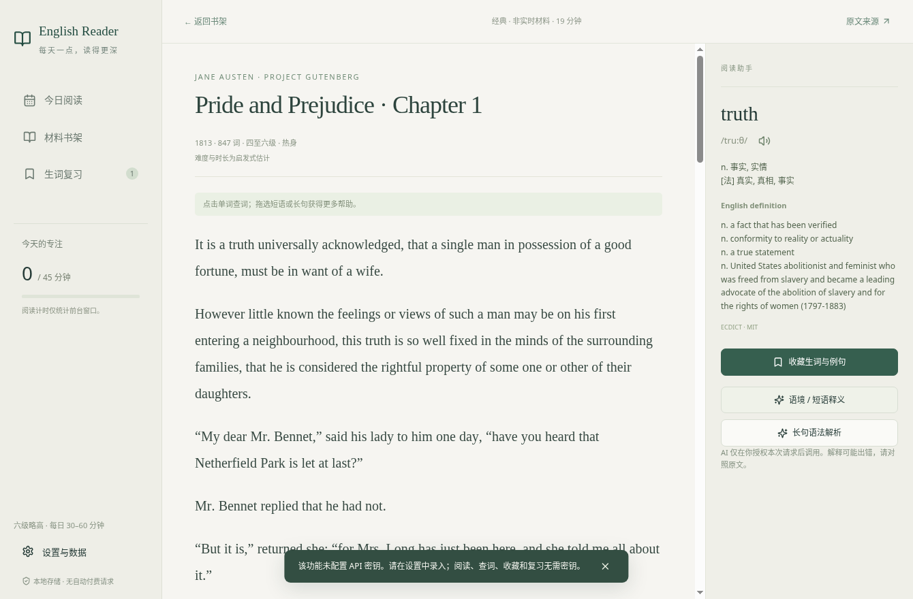

# english-reader
差生文具多

## Windows 英语精读桌面应用（0.1 初版）

每天 30–60 分钟，以六级略高为目标。Electron + React + TypeScript + SQLite；不需要 API key 即可阅读、查词、收藏和复习。



### 已实现

- **真实材料推荐**：从英语 Wikinews 的 Published 分类获取最近 30 天的真实新闻，每轮最多新增 3 篇。显示来源、文章发表日期、许可、字数、估计难度和精读时长；正文缓存本地。启动、当地日期变化、系统联网恢复触发更新；支持手动更新、取消和按页面 ID / URL 去重。
- **经典与新闻分开**：附带 Jane Austen《傲慢与偏见》第一章（1813 年，公版作品）。这是离线经典材料，不是今日新闻，网络失败不会生成假的实时内容。
- **阅读 → 查词 → 收藏 → 复习**：点击正文词语查询 ECDICT 离线英汉双解、词性、音标及词形；支持短语选择。用本地 Windows 英语语音发音，不下载音频。收藏保存生词/短语、释义、原文例句和来源。SM-2 间隔复习支持忘记/困难/正常/轻松，重复点击不会重复收藏或推进同一轮复习。
- **阅读记录**：保存百分比、滚动位置和前台阅读时间，退出后恢复。数据库是实际 SQLite 文件，不依赖浏览器 localStorage。
- **AI**：语境 / 短语释义、长句主干 / 从句 / 修饰 / 指代 / 中文解释、缓存新闻辅助筛选分别配置提供商、HTTPS 地址和模型；提供 DeepSeek 与其他 OpenAI 兼容国内服务入口。无密钥明确提示；每次发送前显示提供商和地址，要求授权文本发送及费用，不自动调用、不自动重试。
- **数据管理**：完整 JSON 备份与恢复（文章正文、进度、生词例句、复习计划、设置、学习时间）；恢复前生成安全备份；导出生词 CSV。备份不含密钥。
- **隐私**：Windows 密钥通过 Electron safeStorage / DPAPI 加密；系统无法安全存储时拒绝保存，不降级明文。隔离渲染进程，关闭 Node 集成，只开放验证参数的 IPC；不配置开机启动，不购买服务、不收集遥测。

### 运行与构建

Windows 10/11 x64，Node.js 24 LTS + npm；首次安装依赖需联网。

```powershell
npm ci
npm run dev
```

`dev` 先执行生产构建，再启动桌面窗口。修改代码后重新运行即可；当前初版没有热更新服务器。

```powershell
npm run typecheck
npm test
npm run test:ui
npm run dist:win
```

Windows 完整构建目标在 `release/`：`English-Reader-0.1.0-x64-Setup.exe`（NSIS）与 `English-Reader-0.1.0-x64-Portable.exe`（便携启动器）。GitHub Actions Windows runner 已成功生成安装包与便携包，见 [验证记录](docs/VALIDATION.md)。单独构建便携包可使用 `npm run dist:portable`。Windows 上打包不需要 Wine；Linux 交叉生成 NSIS/便携启动器需要 Wine。无头 Linux UI 测试需 `xvfb-run -a npm run test:ui`。GitHub Actions 提供 Ubuntu 测试及 Windows 构建流程，未合并、未创建公开 release；已通过的 CI 提交及产物下载入口见验证记录。

云端默认缓存目录只读时，使用仓库外可写缓存，例如：

```bash
npm_config_cache=/tmp/english-reader-npm \
XDG_CACHE_HOME=/tmp/english-reader-cache \
electron_config_cache=/tmp/english-reader-electron \
ELECTRON_GET_USE_PROXY=1 GLOBAL_AGENT_HTTP_PROXY="$HTTPS_PROXY" npm ci
```

只在确有平台代理环境时设置代理；不关闭 TLS 或完整性验证。

### 使用步骤

1. 打开今日阅读，检查联网推荐。无可用新闻时保留缓存，并明确显示原因；下方经典可离线阅读。
2. 打开材料，点击词语查看双解，点击收藏保存当前段落作为例句。拖选短语可查词 / 请求语境解释；拖选长句可请求语法解析。
3. 打开生词复习，先回忆，再显示答案并评分。忘记的卡片 10 分钟后返回；正常首次复习为 1 天，第二次为 6 天，后续根据记忆难度调整。
4. 如需 AI，在设置中为对应功能录入密钥、模型、基础接口地址，再保存。保存不会测试或调用 API。每个功能的密钥独立配置，留空保留已有密钥，“删除本功能密钥”会在保存时删除。
5. 设置中导出 CSV 或创建完整备份。恢复替换当前学习数据，先在数据目录生成 `before-restore-*.json`；恢复后原密钥保留，需核对恢复后的模型地址再授权调用。

语音只使用 `localService=true` 的英语声音。如果系统未安装英语语音，请在 Windows 语言 / 语音设置中安装后重启应用。应用不会把单词发给在线 TTS 服务。

### 数据目录与备份

默认由 Electron `app.getPath('userData')` 确定，Windows 通常位于 `%APPDATA%/english-reader/`，实际路径显示在设置页。主要文件：

- `reader.sqlite`：文章、进度、卡片、设置与学习记录；事务后临时文件写入、同步再替换。
- `key-context.bin` / `key-grammar.bin` / `key-selection.bin`：系统加密密钥，不写入数据库、备份或日志。
- `before-restore-*.json`：恢复前安全备份，包含个人阅读数据，不含密钥。

便携启动器免安装，但学习数据依然放在 Windows 用户数据目录，不随 exe 移动；迁移时使用软件备份，不拷贝加密密钥文件。DPAPI 绑定用户 / 机器，换电脑需要重新录入密钥。

### 来源与开源许可

运行依赖许可原文见 `licenses/dependencies/`、[THIRD_PARTY_NOTICES.md](THIRD_PARTY_NOTICES.md)。`npm run licenses` 验证运行依赖许可并重新生成声明；构建包内保留 Electron / Chromium 原始许可。

- ECDICT：上游声明 MIT，固定提交和 CSV 校验和见 `assets/dictionary-provenance.txt`，48,185 条高频 / 考试词条与词形映射。构建直接使用已提交的 SQLite 词库，不需要重新下载；需要重建时运行 `python scripts/prepare-dictionary.py`，脚本验证固定内容哈希。
- Wikinews：CC BY 4.0，保留贡献者署名、文章永久链接、日期和许可链接；不抓取图片或付费内容。应用只提取正文段落，移除导航与脚注；原文完整版本通过来源链接查看。
- Austen 原作：1813 年公版；摘录自 Project Gutenberg #1342，经 GITenberg 镜像获取，保留完整许可和制作声明。确认所在地区的公版和电子版使用条款。

### 验证结果与限制

详细记录见 [docs/VALIDATION.md](docs/VALIDATION.md)，设计和接口说明见 [docs/ARCHITECTURE.md](docs/ARCHITECTURE.md)。

- 云端 Linux：类型检查、生产构建、26 项单元 / 集成测试，以及实际 Electron 窗口的 2 条无头端到端流程通过。测试联网协议使用明确 fixture；测试数据不会包含在生产推荐中。
- 云端网络策略目前对 Wikinews 和 DeepSeek 官方 API 文档返回 403，**实时新闻抓取未完成线上验证**。不是已经成功推荐新文章。基础地址、接口路径和模型标识已对照 DeepSeek 官方组织维护的集成文档核查（见 docs/API_REFERENCES.md）；当前服务可用性仍需实时验证；未配置密钥、未进行任何真实付费调用。
- 单一 Wikinews 来源更新量有限，不保证每天有新文章。只有最近 30 天且正文 200–2200 词的已发布材料才入库；没有符合条件的材料会明确报告，保留既有缓存。后续扩充来源必须先核实全文再利用许可。
- 难度为句长和长词比例的启发式估计，不是经过校准的考试等级；时长按精读约 45 词/分钟估计。经典第一章可能低于目标难度，界面明确标注为热身材料。
- 词典并非全量 ECDICT；少数专有名词、冷僻词 / 短语可能缺失，部分原始英文释义可能为空。AI 解释需密钥及单次授权，结果可能出错。原始字段里词性也可能包含于释义文本。
- Windows 原生启动、系统语音、DPAPI、安装 / 卸载尚未实机测试。产物未经代码签名，可能触发 Windows SmartScreen；不会关闭或规避安全检查。
- 自动更新只更新阅读材料，不更新应用二进制；不配置开机启动。跨日检查间隔约 1 分钟；新闻响应失败不会标记当天更新成功。恢复联网还受系统 online 事件是否正确发出影响，手动更新可重试。

CI 构建产物为安装包和便携包，保存为保留 7 天的 GitHub Actions artifact；不创建 GitHub Release。当前仍为未签名预览版，Windows 实机验证及完整依赖安全审查尚未完成。历史 Linux 便携构建的校验和在该次 `release/SHA256SUMS.txt`，不应作为当前 CI 产物的校验和。
